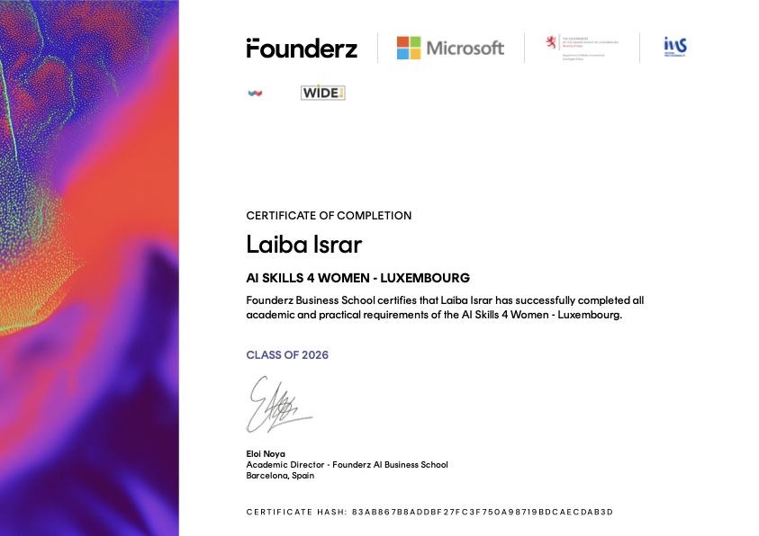

# 🎮 Hangman Game - Aesthetic Edition 🌸

Welcome to my **Hangman Game**! This project is a fun, interactive word-guessing game built with Python and Tkinter.

## ✨ Features
- **Aesthetic UI**: Custom-designed letter buttons and background.
- **Dynamic Categories**: Guess words from different categories like fruits and more.
- **Fun Animations**: Watch the hangman appear as you guess!

## 👩‍💻 Developed By
**Laiba Israr Ahmed**
I am a passionate coder and developer dedicated to creating beautiful and functional applications.

### 🎓 Certifications & Achievements
I am proud to have successfully completed the **AI Skills 4 Women - Luxembourg** program, certified by Founderz and Microsoft.

  

---
*Made with ❤️ by Laiba*
